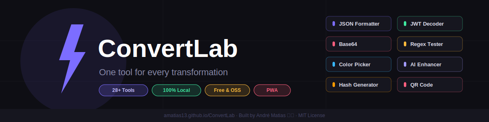

<div align="center">



<br/>

[](https://amatias13.github.io/ConvertLab/)
[](LICENSE)
[](https://react.dev)
[](https://vitejs.dev)
[](https://amatias13.github.io/ConvertLab/)
[](https://amatias13.github.io/Portfolio/)

<br/>

**28+ developer tools. 100% local. No accounts. No servers. Offline-ready.**

[**→ Open ConvertLab**](https://amatias13.github.io/ConvertLab/)

</div>

---

## 🛠️ Tools

<table>
<tr>
<td width="50%" valign="top">

### 🤖 AI

| Tool             | Description                                   |
| ---------------- | --------------------------------------------- |
| AI Text Enhancer | Powered by Pollinations.ai — free, no API key |

### 📦 Data

| Tool           | Description                           |
| -------------- | ------------------------------------- |
| JSON Formatter | Validate, format & minify JSON        |
| Base64         | Encode / decode Base64 strings        |
| URL Encoder    | Encode / decode URLs                  |
| Hash Generator | MD5, SHA-1, SHA-256, SHA-512          |
| JWT Decoder    | Inspect & decode JWT tokens           |
| Number Base    | Convert between bases 2 / 8 / 10 / 16 |
| CSV Viewer     | Visualize CSV as a table              |
| YAML ↔ JSON    | Convert between YAML and JSON         |

### 👁️ Preview

| Tool             | Description                    |
| ---------------- | ------------------------------ |
| Markdown Preview | Live Markdown renderer         |
| HTML Preview     | Live HTML sandbox              |
| Email Preview    | Render HTML emails             |
| SQL Formatter    | Format & highlight SQL queries |

</td>
<td width="50%" valign="top">

### ✏️ Text

| Tool            | Description                           |
| --------------- | ------------------------------------- |
| Regex Tester    | Live regex with match highlight       |
| Text Diff       | Compare two texts side-by-side        |
| Case Converter  | camelCase, snake_case, UPPER and more |
| HTML Entities   | Encode / decode HTML entities         |
| Text Statistics | Word count, readability, frequency    |

### 🎲 Generators

| Tool               | Description                      |
| ------------------ | -------------------------------- |
| UUID Generator     | v4 UUIDs with bulk generation    |
| Lorem Ipsum        | Placeholder text generator       |
| Password Generator | Secure, configurable passwords   |
| Cron Parser        | Parse & explain cron expressions |

### 🔄 Converters

| Tool             | Description                        |
| ---------------- | ---------------------------------- |
| Timestamp        | Unix ↔ human-readable dates        |
| Unit Converter   | Length, weight, temperature & more |
| Number Formatter | Locale-aware number formatting     |

### 🎨 Media

| Tool         | Description                       |
| ------------ | --------------------------------- |
| Image Tools  | Resize, convert & compress images |
| Color Picker | HEX / RGB / HSL with palettes     |
| QR Code      | Generate QR codes instantly       |

</td>
</tr>
</table>

---

## ✨ Features

<table>
<tr>
<td align="center" width="25%">🌙<br/><b>Themes</b><br/><sub>Dark & Light with 6 accent palettes + custom colour picker</sub></td>
<td align="center" width="25%">⚡<br/><b>Instant</b><br/><sub>Every tool responds instantly — no loading, no spinners</sub></td>
<td align="center" width="25%">🔒<br/><b>Private</b><br/><sub>Your data never leaves the browser. Zero server calls.</sub></td>
<td align="center" width="25%">📱<br/><b>PWA</b><br/><sub>Install on desktop or mobile. Works fully offline.</sub></td>
</tr>
<tr>
<td align="center" width="25%">⭐<br/><b>Favorites</b><br/><sub>Pin your most-used tools to the sidebar</sub></td>
<td align="center" width="25%">⌨️<br/><b>Shortcuts</b><br/><sub>⌘K search · 1–9 jump · ⌘B sidebar · ? help</sub></td>
<td align="center" width="25%">💾<br/><b>Portable</b><br/><sub>Export & import all settings across devices</sub></td>
<td align="center" width="25%">🤖<br/><b>Free AI</b><br/><sub>Pollinations.ai — no API key, no account needed</sub></td>
</tr>
</table>

---

## 🚀 Getting Started

### Prerequisites

- [Node.js](https://nodejs.org/) 18+
- npm 9+

### Run locally

```bash
# Clone the repository
git clone https://github.com/Amatias13/ConvertLab
cd ConvertLab

# Install dependencies
npm install

# Start development server
npm run dev
```

Open [http://localhost:5173/ConvertLab/](http://localhost:5173/ConvertLab/) in your browser.

### Build for production

```bash
npm run build
npm run preview  # preview the production build locally
```

---

## 🌐 Deploy

ConvertLab deploys automatically to GitHub Pages via GitHub Actions on every push to `main`.

```
Push to main → GitHub Actions builds → Deploys to GitHub Pages
```

**Setup:**

1. Go to **Settings → Pages → Source: GitHub Actions**
2. Push to `main` — the workflow handles everything automatically

Live at: **[amatias13.github.io/ConvertLab](https://amatias13.github.io/ConvertLab/)**

---

## 📬 Feedback System

ConvertLab sends feedback emails directly from the browser using **[EmailJS](https://www.emailjs.com)** — free tier includes 200 emails/month, no server needed.

**Setup in 5 minutes:**

1. Create a free account at [emailjs.com](https://www.emailjs.com)
2. Add an **Email Service** (Gmail, Outlook, etc.)
3. Create an **Email Template** with these variables:

```
{{feedback_type}}  {{message}}  {{from_name}}  {{reply_to}}  {{time}}
```

4. Copy your **Service ID**, **Template ID** and **Public Key**
5. Create a `.env.local` file in the root:

```env
VITE_EMAILJS_SERVICE_ID=your_service_id
VITE_EMAILJS_TEMPLATE_ID=your_template_id
VITE_EMAILJS_PUBLIC_KEY=your_public_key
```

> ⚠️ Never commit `.env.local` to version control. It is already ignored by default in `.gitignore`.

---

## 🧑‍💻 About the Author

<table>
<tr>
<td width="80" valign="top">

</td>
<td valign="top">

**André Matias** — Full Stack Developer · Moita, Setúbal, Portugal 🇵🇹

💼 Software Engineer at [INSTICC](https://insticc.org) &nbsp;·&nbsp; 🚀 Co-founder of Code Lusitan<br/>
🎓 Software Engineering — Instituto Politécnico de Setúbal<br/>
📌 React · Node.js · JavaScript · SQL · RESTful APIs · .NET

[](https://amatias13.github.io/Portfolio/)
[](https://www.linkedin.com/in/andre-matias-dev/)
[](https://github.com/Amatias13)

</td>
</tr>
</table>

---

## ☕ Support

ConvertLab is **free, open-source, and ad-free**. If it saves you time, consider supporting:

<a href="https://buymeacoffee.com/andrematiasdev">
  
</a>
&nbsp;&nbsp;
<a href="https://github.com/Amatias13/ConvertLab">
  
</a>

---

## 📄 License

Copyright © 2024 André Matias

Licensed under the [MIT License](LICENSE) — free to use, modify and distribute with attribution.
